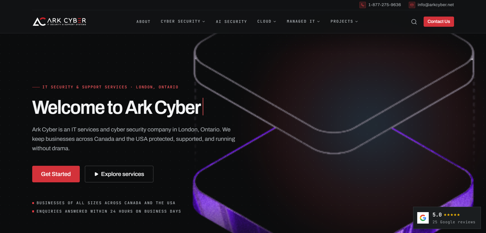

# Rishee Technology Services Limited

## Screenshot

<!-- Add your landing page screenshot to the repo and update the path below -->



## Description

The project includes the landing page, About page, and Contact page, built with Vite, Tailwind CSS, and React Router.

## Install & run locally

### Prerequisites

- [Node.js](https://nodejs.org/) (v18 or newer recommended)
- npm

### Install

```bash
git clone https://github.com/ashutosh2803/rishee-technology-services-limited.git
cd rishee-technology-services-limited
npm install
```

### Run

```bash
npm run dev
```

Open the URL shown in the terminal (usually `http://localhost:5173`).
